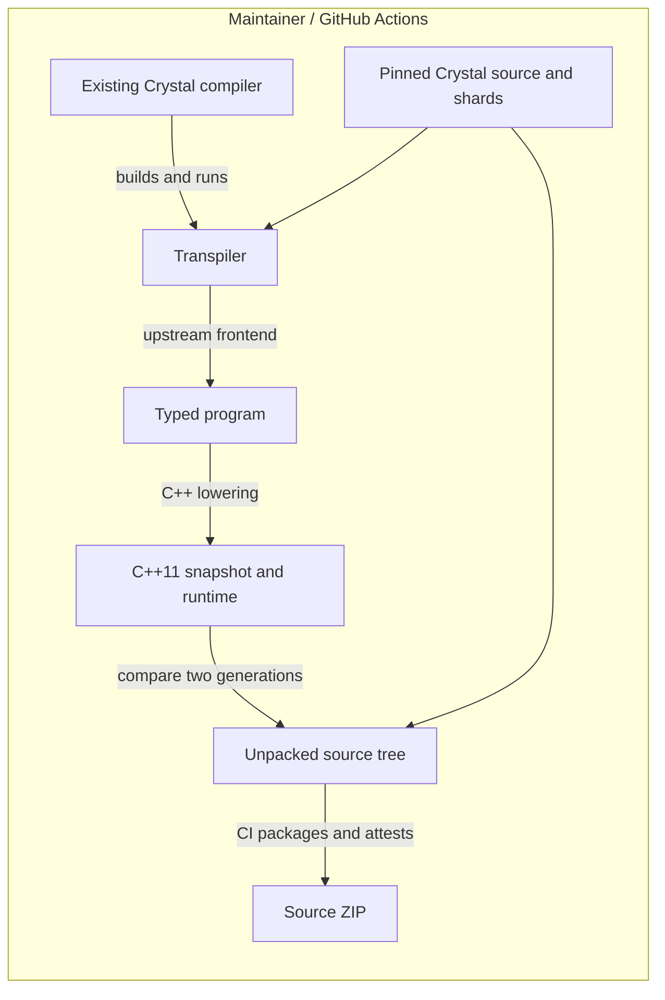
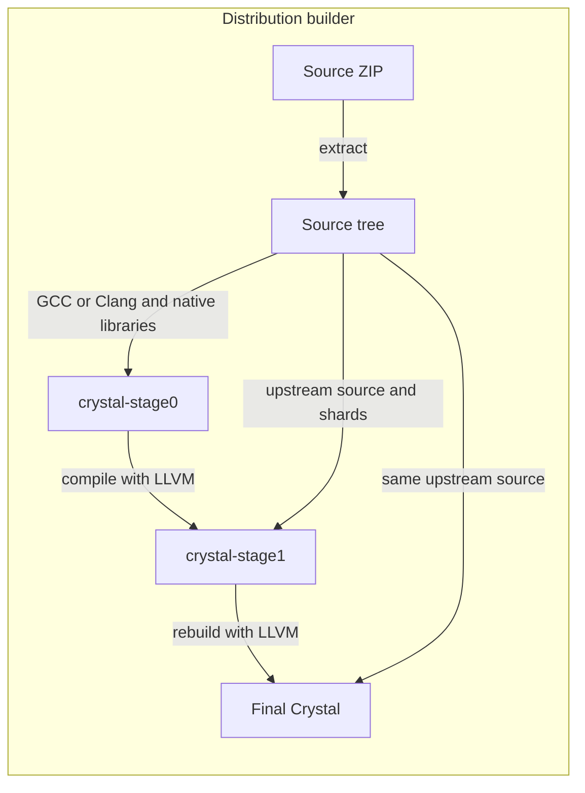

# crystal-bootstrap

crystal-bootstrap translates the upstream Crystal compiler to C++11. This lets
distribution builders start with GCC or Clang instead of a prebuilt Crystal
compiler. The goal is to bring Crystal into Guix's source bootstrap.

The transpiler is written in Crystal and reuses upstream's frontend, compiler
algorithms and reachable library code. We maintain the C++ lowering and runtime
adapters. The generated stage0 compiler keeps upstream's LLVM backend to build
the next stage.



---



[release.json](release.json) selects Crystal 1.21.0 on Linux x86-64 with LLVM 20.
The full compiler chain for this target and its Guix dependency closure still
need validation. A [development build of 1.22.0-dev](docs/reproducibility.md)
completed the chain and matched a same-version upstream reference with LLVM 22.

## Build from released sources

Download a [source release](https://github.com/soupglasses/crystal-bootstrap/releases),
follow the [verification instructions](docs/releasing.md#verify-a-download),
and extract the ZIP. Install the dependencies listed in its README, then run
from the extracted directory:

```sh
make CXX=clang++ LLVM_CONFIG=llvm-config-20
./build/crystal --version
```

The archive includes the generated C++, runtime, pinned upstream and shard
sources, build tools and notices. Building it is offline and requires neither
Git nor an installed Crystal compiler. The [RPM spec](packaging/crystal-bootstrap.spec)
is an OBS packaging example that still needs distribution validation.

GitHub Actions checks source determinism and attests the archives. Distribution
builders must also validate the compiler chain by comparing the final binary
with a reproducible, same-version upstream reference under an identical recipe.

## Generate locally

Install Python 3.12+, Make, LLVM development tools, Boehm GC and PCRE2. Then run:

```sh
make generate LLVM_CONFIG=llvm-config-20
```

This downloads the pinned sources and official Crystal host. To use an existing
host, pass `CRYSTAL=/path/to/crystal`. `TARGET=1.21.0` selects an entry from
`release.json`; the first entry is the default.

The command generates twice, compares the snapshots byte for byte (including
manifests), and rejects unsupported constructs. After both runs succeed, it
replaces `build/generated/1.21.0/` with the new source tree. A failed run leaves
the previous tree intact. Use `OUTPUT=/path/to/output` to change the destination
and a separate directory for each target.

Local generation stops at the unpacked tree. Packaging and attestations belong
to the GitHub release workflow; generated sources stay out of Git.

Build it with `make bootstrap CXX=clang++ LLVM_CONFIG=llvm-config-20`, passing
the same `OUTPUT` if you changed the destination. See [releasing](docs/releasing.md)
for publication and distribution settings.

## Development

Start with the [build and verification guide](docs/compiler-translation.md).
Differential fixtures, compiler component probes and allocation tests cover the
bootstrap workload. General Crystal conformance is outside the project's scope.

- [Architecture](docs/architecture.md): frontend boundary and generated source inputs.
- [Lowering](docs/lowering.md) and [runtime](docs/runtime.md): representation and semantic contracts.
- [Reproducibility results](docs/reproducibility.md): historical measurements and verification records.
- [Research](docs/research.md): Guix constraints and related bootstrap designs.
