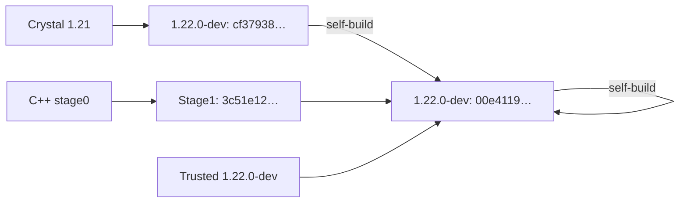

# Development build results

The 2026-09-12 development build completed the compiler chain for Crystal
1.22.0-dev and matched a reproducible same-version upstream reference. These
results apply to the recorded snapshot and recipe, not the configured Crystal
1.21 source release. The generated tree is no longer tracked in Git.

## Inputs and resource use

The [verification record](verification/2026-09-12/verification.json) records upstream
revision `f4acc09db3edbc51cf526ba97808fbaa3e857ea9`, Linux x86-64 and LLVM 22.1.8.
Generation used Crystal 1.21.0. Native dependencies included Boehm GC 8.2.12,
utf8proc 2.11.3 and PCRE2 10.47. The record includes hashes of
the generator, runtime, source inputs, snapshot manifest and native stage0
binary used in the comparison.
The [historical shard lock](verification/2026-09-12/shard.lock) matches the record's
recorded checksum; current release pins live in `release.json`.

Strict generation emitted 72,613 definitions in 418 C++ translation units with
no unsupported paths. Two independent runs produced identical bytes for all
423 members, including the manifest, with the same declared source paths.

| Build step | Wall time | Peak RSS |
| --- | ---: | ---: |
| Native stage0, Clang 22.1.8 at `-O0` | 467 s | 838,784 KiB |
| Stage0 compiling stage1 | 447 s | 5,955,924 KiB |
| Stage1 compiling the final compiler | 63 s | 4,059,136 KiB |

Stage0 ran with a 512 MiB stack limit for unoptimized recursive type inference;
subsequent builds used the normal limit. An earlier snapshot also compiled with
GCC 16.2.1, taking 1,071 s at 1,144,372 KiB peak RSS. That build is not a
same-snapshot GCC/Clang performance comparison.

Differential fixtures and standalone runtime stress passed GCC and Clang at
`-O0` and `-O2`. The stress workloads retained live values under a 32 MiB GC heap
limit while allocating more than 1 GiB cumulatively; the standalone runtime test
also passed Clang's undefined-behavior sanitizer. These bounds describe the test
workloads, not full compiler memory use. [Runtime validation](runtime.md#memory-validation)
describes the checks.

## Binary comparison

All compared builds used the revision and LLVM version above,
`SOURCE_DATE_EPOCH=0`, one compiler thread, no debug information, and the flags
in the verification record. Source, output and cache paths were identical,
with the cache cleared each time. The recipe disabled optional compiler features and
release optimization.

| Build | SHA256 |
| --- | --- |
| Trusted 1.22.0-dev, repeated twice | `00e4119a5c627039603883ddee40d456d830effb2b0554b0fb0a071fb7213737` |
| That reference rebuilding itself | `00e4119a5c627039603883ddee40d456d830effb2b0554b0fb0a071fb7213737` |
| Stage1 from the generated native stage0 | `3c51e12a74c22f1fe4779ef0b44e887d9f710ed7f874d0edb83a928e2ce8c935` |
| Final compiler built by stage1 | `00e4119a5c627039603883ddee40d456d830effb2b0554b0fb0a071fb7213737` |
| Crystal 1.21 compiling 1.22.0-dev, repeated twice | `cf379382351e1bd4b412fb82525ecc584e8df1b5da0b50b151e091877d8842c7` |
| That 1.21-produced reference rebuilding 1.22.0-dev | `00e4119a5c627039603883ddee40d456d830effb2b0554b0fb0a071fb7213737` |

Crystal 1.21 was built locally against LLVM 22.1.8 for this comparison. Its
version, binary hash and results are recorded in the
[cross-version comparison](verification/2026-09-12/n-1-verification.json).

The direct Crystal 1.21 builds agreed with each other but differed from the
bootstrap final. One self-build converged to the same final binary. Direct
cross-version equality is outside the acceptance criterion; the same-version
reference was reproducible and matched.

A diagnostic build reverted upstream's
[unused yield-block value change](https://github.com/crystal-lang/crystal/commit/43ae759b4b8c140851f177eebb338fa5b6d08243)
and still did not produce the direct 1.21 hash. The remaining differences were
not isolated. The measured snapshot and final source retained upstream's
implementation.

## Source-only run and limits

The [source-only build record](verification/2026-09-12/source-only-verification.json) records a
complete run with a failing `crystal` command first on PATH and `CRYSTAL` pointing
to that guard. Neither was invoked. This run used separate output/cache paths,
so its binary hashes are not compared with the table above.

For current build and audit commands, see [compiler verification](compiler-translation.md).
The audit requires agreement with both the direct reference and its self-build.
Using an older reference can therefore fail even when its self-build converges.

Crystal embeds cache paths even without debug information. These results do not
establish matching binaries after relocation, with release optimization, with
full optional features, under another LLVM version, or in Guix. The native
stage0 executable itself need not match across native compilers. Guix packaging
and other target ABIs remain unverified.
